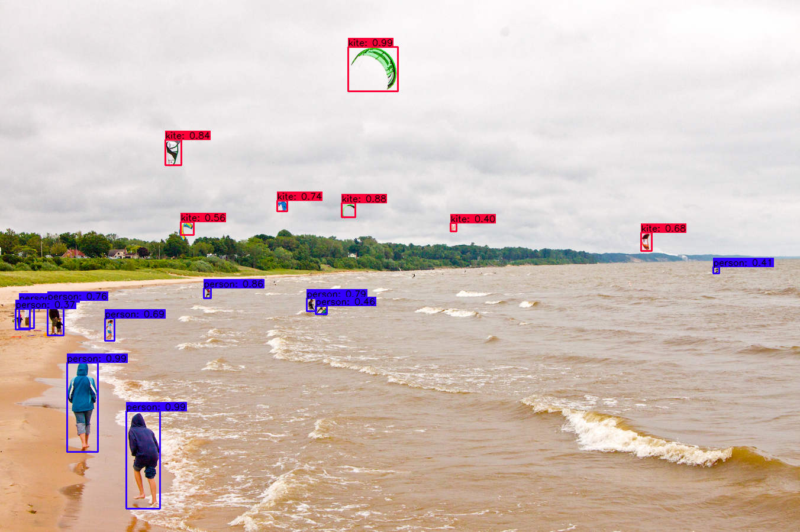

# yolov4-funciones-personalizadas
[](LICENSE)

Una amplia gama de funciones personalizadas para YOLOv4, YOLOv4-tiny, YOLOv3 y YOLOv3-tiny implementadas en TensorFlow, TFLite y TensorRT.

DISCLAIMER: Este repositorio es muy similar a mi repositorio: [https://github.com/theAIGuysCode/tensorflow-yolov4-tflite](https://github.com/EduardoHuerta/Contador-Objetos-Personalizado-Yolov4-tf). Creé este repositorio para explorar las funciones personalizadas de codificación que se implementarán con YOLOv4, y pueden empeorar la velocidad general de la aplicación y hacer que no esté optimizada con respecto a la complejidad del tiempo. Este es para explorar personalizaciones y aplicaciones geniales que pueden ser creadas usando YOLOv4!

### Demo de Funcion contadora de Objetos de clases personalizadas en accion!
<p align="center"></p>

### Conda (Recomendado)

```bash
# Tensorflow CPU
conda env create -f conda-cpu.yml
conda activate yolov4-cpu

# Tensorflow GPU
conda env create -f conda-gpu.yml
conda activate yolov4-gpu
```

### Pip
```bash
# TensorFlow CPU
pip install -r requirements.txt

# TensorFlow GPU
pip install -r requirements-gpu.txt
```
### Nvidia Driver (Para la GPU, si no estás usando el entorno de Conda y no has configurado CUDA todavía)
Asegúrate de usar la versión 10.1 de CUDA Toolkit, ya que es la versión adecuada para la versión de TensorFlow usada en este repositorio..
https://developer.nvidia.com/cuda-10.1-download-archive-update2

## Descargando los pesos oficiales pre-entrenadas
YOLOv4 viene pre-entrenado y es capaz de detectar 80 clases. Para facilitar la demostración usaremos los pesos pre-entrenados.
Descargue el archivo yolov4.weights pre-entrenado: https://drive.google.com/open?id=1cewMfusmPjYWbrnuJRuKhPMwRe_b9PaT

Copia y pega yolov4.weights de tu carpeta de descargas en la carpeta de 'data' de este repositorio.

Si quieres usar yolov4-tiny.weights, un modelo más pequeño que es más rápido en la ejecución de las detecciones pero menos preciso, descarga el archivo aquí: https://github.com/AlexeyAB/darknet/releases/download/darknet_yolo_v4_pre/yolov4-tiny.weights

## Usando pesos YOLOv4 entrenados a medida
<strong>Aprende a entrenar pesos personalizados de YOLOv4 aquí: https://www.youtube.com/watch?v=mmj3nxGT2YQ </strong>

<strong>Observa como correr usando el modelo personalizado en TensorFlow :https://www.youtube.com/watch?v=nOIVxi5yurE </strong>

USAR MI MATRÍCULA ENTRENADO PESOS PERSONALIZADOS: https://drive.google.com/file/d/1-46gRM6iIHtRkRj37fwZIVr9W7PxBDt9/view?usp=sharing

Copie y pegue su archivo personalizado .weights en la carpeta 'data' y copie y pegue sus nombres personalizados en la carpeta 'data/classes/'.

El único cambio dentro del código que necesitas hacer para que tu modelo personalizado funcione es en la línea 14 del archivo 'core/config.py'.
Actualice el código para que apunte a su archivo personalizado .names como se ve a continuación. (mi archivo .names personalizado se llama custom.names pero el tuyo puede tener un nombre diferente)
<p align="center"></p>

<strong>Nota:</strong> Si estás usando el yolov4 pre-entrenado, entonces asegúrate de que la línea 14 permanezca <strong>coco.names</strong>.

## YOLOv4 Usando Tensorflow (tf, .pb model)
Para implementar YOLOv4 usando TensorFlow, primero convertimos los .weights en los correspondientes archivos de modelo de TensorFlow y luego ejecutamos el modelo.
```bash
# Convierte los pesos de la oscuridad en flujo tensorial
## yolov4
python save_model.py --weights ./data/yolov4.weights --output ./checkpoints/yolov4-416 --input_size 416 --model yolov4 

# Ejecutar modelo de tensorflow yolov4 
python detect.py --weights ./checkpoints/yolov4-416 --size 416 --model yolov4 --images ./data/images/kite.jpg

# Ejecutar yolov4 en video
python detect_video.py --weights ./checkpoints/yolov4-416 --size 416 --model yolov4 --video ./data/video/video.mp4 --output ./detections/results.avi

# Ejecutar yolov4 en webcam
python detect_video.py --weights ./checkpoints/yolov4-416 --size 416 --model yolov4 --video 0 --output ./detections/results.avi
```
Si quieres ejecutar yolov3 o yolov3-tiny cambia ``--model yolov3`` y el archivo .pesos en los comandos anteriores.

<strong>Nota:</strong> También puedes hacer funcionar el detector en múltiples imágenes a la vez cambiando la bandera de --imágenes como tal ``--images "./data/images/kite.jpg, ./data/images/dog.jpg"``

### Resultado de Imagen(es) (Regular TensorFlow)
Puedes encontrar la(s) imagen(es) de salida que muestra(n) las detecciones guardadas dentro de la carpeta "detecciones".
#### Ejemplo de modelo Pre-entrenado YOLOv4
<p align="center"></p>

### Resultado de Video
El video guarda donde quiera que apunte... la bandera de salida(--output). Si no pones la bandera entonces tu video no se guardará con detecciones en él.
<p align="center"></p>

## YOLOv4-Tiny usando TensorFlow
TLos siguientes comandos te permitirán ejecutar el modelo yolov4-tiny.``
# yolov4-tiny
python save_model.py --weights ./data/yolov4-tiny.weights --output ./checkpoints/yolov4-tiny-416 --input_size 416 --model yolov4 --tiny

# Ejecutar modelo de tensorflow yolov4-tiny  
python detect.py --weights ./checkpoints/yolov4-tiny-416 --size 416 --model yolov4 --images ./data/images/kite.jpg --tiny
```

## YOLOv4 Personalizado Utilizando TensorFlow
Los siguientes comandos te permitirán ejecutar tu modelo personalizado yolov4. (los comandos de video y cámara web también funcionan)
```
# yolov4 personalizado
python save_model.py --weights ./data/custom.weights --output ./checkpoints/custom-416 --input_size 416 --model yolov4 

# Ejecuta yolov4 personalizado con el modelo tensorflow
python detect.py --weights ./checkpoints/custom-416 --size 416 --model yolov4 --images ./data/images/car.jpg
```

#### Ejemplo de modelo personalizado YOLOv4 (ver el enlace de vídeo de arriba para entrenar a este modelo)
<p align="center"></p>

## Funciones personalizadas y banderas
Aquí está cómo usar todas las funciones y banderas personalizadas actualmente soportadas que he creado.

<a name="counting"/>

### Contador de Objetos (numero total de objetos por class)
He creado una función personalizada dentro del archivo [core/functions.py](https://github.com/EduardoHuerta/Contador-Objetos-Personalizado-Yolov4-tf/core/functions.py) que puede ser usado para contar y llevar un registro del número de objetos detectados en un momento dado dentro de cada imagen o video. Puede ser usado para contar el total de objetos encontrados o puede contar el número de objetos detectados por clase.

#### Contador de objetos Totales
Para contar los objetos totales todo lo que se necesita es añadir la bandera personalizada "--count" a su comando detect.py o detect_video.py.
```
# Ejecutar modelo yolov4 mientras el contador detecta objetos totales.
python detect.py --weights ./checkpoints/yolov4-416 --size 416 --model yolov4 --images ./data/images/dog.jpg --count
```
Al ejecutar el comando anterior se contará el número total de objetos detectados y se enviará a la línea de comandos o al shell, así como a la detección guardada como tal:
<p align="center"></p>

#### Contar los objetos por clase
Para contar el número de objetos de cada clase individual de su detector de objetos, debe añadir la bandera personalizada "--count", así como cambiar una línea en el script detect.py o detect_video.py. De forma predeterminada, la función count_objects tiene un parámetro llamado <strong>by_class</strong> que está establecido en False. Si cambia este parámetro a <strong>True</strong> contará por clase en su lugar.

Para contar por clase haz que detect.py o detect_video.py se vea así:
<p align="center"></p>

Entonces ejecuta el mismo comando de arriba:
```
# Ejecute el modelo yolov4 mientras cuenta los objetos por clase
python detect.py --weights ./checkpoints/yolov4-416 --size 416 --model yolov4 --images ./data/images/dog.jpg --count
```
Al ejecutar el comando anterior se contará el número de objetos detectados por clase y se enviará a la línea de comandos o al shell, así como a la detección guardada como tal:
<p align="center"></p>

<strong>Note:</strong> You can add the --count flag to detect_video.py commands as well!

<a name="info"/>

### Imprimir información detallada sobre cada detección (clase, confianza, coordenadas del cuadro delimitador)
He creado una bandera personalizada llamada <strong>INFO</strong> que puede ser añadida a cualquier comando detect.py o detect_video.py para imprimir información detallada sobre cada detección hecha por el detector de objetos. Para imprimir la información detallada en su línea de comandos sólo tiene que añadir la bandera "--info" a cualquiera de sus comandos. La información de cada detección incluye la clase, la confianza en la detección y las coordenadas del cuadro delimitador de la detección en formato xmin, ymin, xmax, ymax.

Si quieres editar la información que se imprime, puedes editar la función <strong>draw_bbox</strong> que se encuentra dentro del archivo [core/utils.py](https://github.com/EduardoHuerta/Contador-Objetos-Personalizado-Yolov4-tf/core/utils.py). La línea que imprime la información tiene el siguiente formato:
<p align="center"></p>

Ejemplo de campo de información agregado al comando:
```
python detect.py --weights ./checkpoints/yolov4-416 --size 416 --model yolov4 --images ./data/images/dog.jpg --info
```
El resultado de la salida dentro de su Powershell o terminal:
<p align="center"></p>

<strong>Nota:</strong> You can add the --info flag to detect_video.py commands as well!

## YOLOv4 Usando TensorFlow Lite (.tflite model)
También puede implementar YOLOv4 usando TensorFlow Lite. TensorFlow Lite es un modelo mucho más pequeño y perfecto para dispositivos móviles o de borde (raspberry pi, etc).
```bash
# Guardar el modelo tf para convertir a tflite
python save_model.py --weights ./data/yolov4.weights --output ./checkpoints/yolov4-416 --input_size 416 --model yolov4 --framework tflite

# yolov4
python convert_tflite.py --weights ./checkpoints/yolov4-416 --output ./checkpoints/yolov4-416.tflite

# yolov4 quantize float16
python convert_tflite.py --weights ./checkpoints/yolov4-416 --output ./checkpoints/yolov4-416-fp16.tflite --quantize_mode float16

# yolov4 quantize int8
python convert_tflite.py --weights ./checkpoints/yolov4-416 --output ./checkpoints/yolov4-416-int8.tflite --quantize_mode int8 --dataset ./coco_dataset/coco/val207.txt

# Ejecutar tflite model
python detect.py --weights ./checkpoints/yolov4-416.tflite --size 416 --model yolov4 --images ./data/images/kite.jpg --framework tflite
```
### Resultado de Imagen (TensorFlow Lite)
You can find the outputted image(s) showing the detections saved within the 'detections' folder.
#### Ejemplo de TensorFlow Lite int8 
<p align="center"></p>

Yolov4 and Yolov4-tiny int8 quantization have some issues. I will try to fix that. You can try Yolov3 and Yolov3-tiny int8 quantization 


```bash
save_model.py:
  --weights: path to weights file
    (default: './data/yolov4.weights')
  --output: path to output
    (default: './checkpoints/yolov4-416')
  --[no]tiny: yolov4 or yolov4-tiny
    (default: 'False')
  --input_size: define input size of export model
    (default: 416)
  --framework: what framework to use (tf, trt, tflite)
    (default: tf)
  --model: yolov3 or yolov4
    (default: yolov4)

detect.py:
  --images: path to input images as a string with images separated by ","
    (default: './data/images/kite.jpg')
  --output: path to output folder
    (default: './detections/')
  --[no]tiny: yolov4 or yolov4-tiny
    (default: 'False')
  --weights: path to weights file
    (default: './checkpoints/yolov4-416')
  --framework: what framework to use (tf, trt, tflite)
    (default: tf)
  --model: yolov3 or yolov4
    (default: yolov4)
  --size: resize images to
    (default: 416)
  --iou: iou threshold
    (default: 0.45)
  --score: confidence threshold
    (default: 0.25)
  --count: count objects within images
    (default: False)
  --dont_show: dont show image output
    (default: False)
  --info: print info on detections
    (default: False)
    
detect_video.py:
  --video: path to input video (use 0 for webcam)
    (default: './data/video/video.mp4')
  --output: path to output video (remember to set right codec for given format. e.g. XVID for .avi)
    (default: None)
  --output_format: codec used in VideoWriter when saving video to file
    (default: 'XVID)
  --[no]tiny: yolov4 or yolov4-tiny
    (default: 'false')
  --weights: path to weights file
    (default: './checkpoints/yolov4-416')
  --framework: what framework to use (tf, trt, tflite)
    (default: tf)
  --model: yolov3 or yolov4
    (default: yolov4)
  --size: resize images to
    (default: 416)
  --iou: iou threshold
    (default: 0.45)
  --score: confidence threshold
    (default: 0.25)
  --count: count objects within video
    (default: False)
  --dont_show: dont show video output
    (default: False)
  --info: print info on detections
    (default: False)
```

### References  

   Huge shoutout goes to hunglc007 for creating the backbone of this repository:
  * [tensorflow-yolov4-tflite](https://github.com/hunglc007/tensorflow-yolov4-tflite)
  * [yolov4-custom-functions](https://github.com/theAIGuysCode/yolov4-custom-functions)
